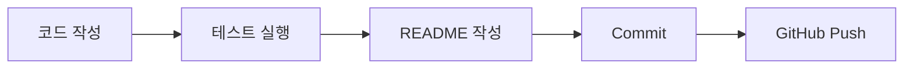

# 프로젝트 이름

이 프로젝트가 무엇을 하는지 한두 문장으로 설명합니다.

## 목표

- 목표 1
- 목표 2
- 목표 3

## 실행 방법

```powershell
python main.py
```

## 테스트 방법

```powershell
python -m pytest
```

## 학습 기록

- 배운 점
- 어려웠던 점
- 다음에 개선할 점
# 가장 큰 제목
## 중간 제목
### 작은 제목
- Python 파일 작성
- 테스트 실행
- GitHub에 push


python main.py
python -m pytest
```

## 5. 표 쓰기

```markdown
| 항목 | 설명 |
| --- | --- |
| main.py | 프로그램 실행 파일 |
| test_main.py | 테스트 파일 |
| README.md | 프로젝트 설명 문서 |
```

## 6. 링크 넣기
[GitHub](https://github.com)

[테스트 파일](../00_references/markdown-readme-guide.md)


````markdown

````
